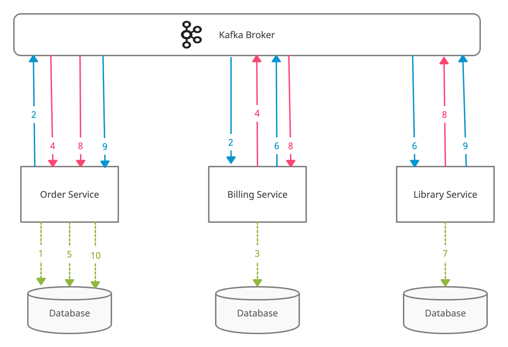

# otushw9
Реализация распределенной транзакции основываясь на паттерн Сага 
Решение через хореографию  

### Событийная модель заказа
- заказ создан
- заказ оплачен
- ошибка оплаты заказа
- заказ оформлен
- ошибка оформления заказа

### Состояния заказа
- черновик
- создан
- оплачен
- оформлен
- отменен

### Прорцесс обработки заказа
1. OrderService сохраняет заказ в БД в состоянии Создан
2. OrderService публикует событие "заказ создан" и BillingService слушает событие
3. BillingService списывает средства со счета клиента
4. Ошибка списания. BillingService публикует событие "ошибка оплаты заказа", OrderService слушает событие
5. OrderService меняет статус заказа на Отменен
6. BillingService публикует событие "заказ оплачен" и LibraryService слушает событие
7. LibraryService оформляет подписку на книгу
8. Ошибка оформления подписки. LibraryService публикует событие "ошибка оформления заказа", 
BillingService слушает событие и возвращает средства на счет, OrderService слушает событие и меняет статус заказа на Отменен
9. LibraryService публикует событие "заказ оформлен", OrderService слушает событие и меняет статус заказа на Оформлен